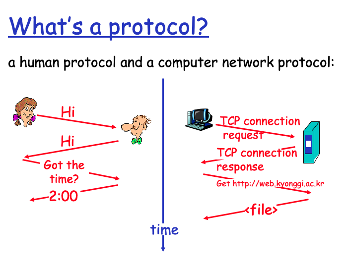

# 1. 인터넷이란 무엇인가?

### 개요

* **인터넷이란 무엇인가?**
* 프로토콜이란 무엇인가?
* 네트워크 edge : hosts, access net, physical media
* 네트워크 core : packet / circuit switching, Internet structure
* 퍼포먼스 : loss, delay, throughput
* 보안
* protocol layers, service models

### 인터넷이란 무엇인가? : "nuts and bolts" 관점

네트워크 시스템의 구축 요소

* 수백만 개의 연결된 컴퓨터 장치
  * Host = end systems\(PC, Server, 노트북, 스마트폰 등등...\)
  * 네트워크 앱 실행
* 통신 링크
  * 광섬유, 구리선 : 유선
  * 전송률 = 대역폭
* 라우터
  * 패킷 전달\(packets : 데이터 chunks\)
* 프로토콜
  * 프로토콜은 메시지 전송, 수신을 제어하는 규약

인터넷 : _**네트워크들의 네트워크**_

* loosely hierarchical : 느슨한 계층
* 공용 인터넷 vs 개인 인트라 넷
* 인터넷 표준
  * RFC : Request for comments
  * IETF : Internet Engineering Task Force

### 인터넷이란 무엇인가? : 서비스 관점

‌통신 인프라는 분산된 애플리케이션을 가능하게 합니다.

* WEB
* VoIP
* email
* games
* e-commerce
* file sharing

‌애플리케이션에 제공되는 통신 서비스

* 소스에서 타겟으로 안정적인 데이터 전달
* "최선의"\(하지만 신뢰할 수 없는\) 데이터 전달

### 프로토콜은 무엇인가?

#### 사람과 사람간의 프로토콜

* "지금 몇 시야?"
* "질문이 하나 있어"
* 소개

각각의 질문에 대한 어느정도 정해진 대답이 있고, 소개라는 것도 어느정도 정해진 규정이 있다.

특정한 메시지를 보내면 ←→ 메시지 수신지 취해진 특정 조치 또는 기타 이벤트

#### 네트워크에서의 프로토콜

* 인간보다는 기계
* 프로토콜에 의해 관리되는 인터넷의 모든 통신 활동

_**프로토콜은 형식, 네트워크 엔티티간에 송수신되는 메시지의 순서, 메시지 전송, 수신에 대해 수행되는 작업을 정의합니다.**_

